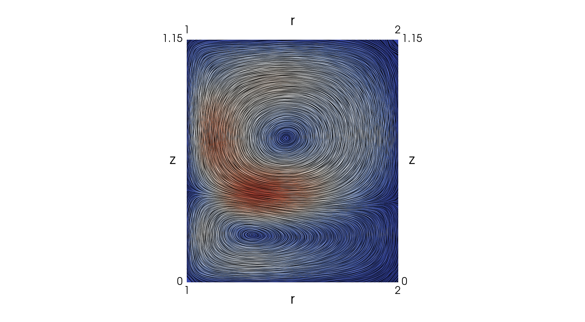

## My research in plain words
____________________________

## Transition to Turbulence in Shear Flows:
____________________________

#### Invariant Subspaces:
It is important to study the symmetries of a system because they influence dynamics and determine kinds of allowable solutions. We consider plane Poiseuille flow (PPF) driven by a constant bulk velocity constraint. We classify relevent symmetric subspaces of PPF and also compute traveling waves in a few of them, using the knowledge about symmetries to simplify numerical computations. I presented a poster based on this work at the Boulder Summer School 2022 - [bss_poster](http://pratikaghor.github.io/_pages/posters/aghor_symmetry_bss.pdf). Prof. Gibson and I are currently working on an article based on this work that will be submitted to the Journal of Fluid Mechanics (JFM). 

#### Edge of Chaos:
Edge of chaos is the boundary betweeen basins of attractions of laminar and turbulent flows. The exact nonlinear solutions of the governing Navier-Stokes equations that live on this edge-manifold are known as 'edge states'. They have only one unstable direction, perturbed one way, the flow decays back to the laminar state, perturbed the other way, the flow is sucked into the turbulent attractor. We found some interesting behaviour of edge states of plane Poiseuille flow. Prof. Gibson and I are currently working on an article based on this work that will be submitted to the Physical Review Fluids (PRF).

## Taylor-Couette Flow (TCF):
____________________________
Taylor–Couette flow (TCF) refers to the annular flow between two concentric, differentially rotating cylinders. After [Taylor's seminal 1923 article](https://royalsocietypublishing.org/doi/abs/10.1098/rsta.1923.0008), the topic remains an active research area even today after a centrury due to its experimental simplicity and a wide range of applications. 

#### Compressible TCF: Multiroll transition and the roll of Compressibility
In this work, the asymmetric 2-roll modes (called the single-roll or ‘anomalous’ modes), that break the midplane  $$Z_2$$-symmetry, are uncovered at $$\Gamma \leq O(1)$$, where $$\Gamma = h/ \delta $$ is the aspect ratio with $$h$$ being the height of the cylinders and $$\delta$$ being the gap width. The phase boundaries of both symmetric and asymmetric rolls and the coexisting regions of different number of rolls are identified in the $$(\Gamma , Re )$$-plane, where $$Re$$ is the inner Reynolds number. We were able to show that the ‘$$1 \leftrightarrow 2$$’-roll transition in small aspect ratio cylinders is subcritical in compressible TCF in contrast to the supercritical nature of bifurcation in its incompressible counterpart. This work was published in the [Journal of Fluid Mechanics](https://www.cambridge.org/core/journals/journal-of-fluid-mechanics/article/abs/nonlinear-axisymmetric-taylorcouette-flow-in-a-dilute-gas-multiroll-transition-and-the-role-of-compressibility/B528D542F58FC12D8F666BA1207249FA).

#### Radially heated TCF:
I am working with a long time friend Mohammad Atif, a postdoc at the Brookheaven National Labs, NY, on a radially heated version of the classical TCF. We are currently writing a paper based on linear stability analysis of the system. 

## Porous Media Convection (PMC):
____________________________
#### Sheared PMC:
I am working with Remil Mushtaq, a fellow grad student at UNH, investigating the effect of shear on the classical porous media convection. We recently started working on the problem and are already getting some interesting results.
